# Which APS API Do I Need?

**Interactive decision tree to help you choose the right Autodesk Platform Services API for your project**

---

## Quick Decision Flowchart

```mermaid
flowchart TD
    Start([What do you want to build?]) --> Q1{Need to display 3D models<br/>in a web browser?}
    
    Q1 -->|Yes| Viewer[🎯 **Viewer SDK** + Model Derivative<br/>📋 Use: Initialize 3D viewer<br/>📦 Formats: SVF2, SVF<br/>💡 RAPS: `raps view &lt;urn&gt;`]
    
    Q1 -->|No| Q2{Need to store/manage files<br/>in the cloud?}
    
    Q2 -->|Yes| Q3{Working with BIM 360/<br/>ACC projects?}
    
    Q3 -->|Yes| BIM360[🎯 **Data Management API**<br/>📋 Use: Project files & folders<br/>📦 Context: User's BIM projects<br/>💡 RAPS: `raps dm projects`<br/>🔑 Auth: 3-legged OAuth]
    
    Q3 -->|No| Q4{Just need simple<br/>file storage?}
    
    Q4 -->|Yes| OSS[🎯 **Object Storage Service**<br/>📋 Use: Upload/download files<br/>📦 Context: Your app's storage<br/>💡 RAPS: `raps oss upload &lt;file&gt; &lt;bucket&gt;`<br/>🔑 Auth: 2-legged OAuth]
    
    Q2 -->|No| Q5{Need to convert<br/>file formats?}
    
    Q5 -->|Yes| Q6{Converting to viewable<br/>formats for web?}
    
    Q6 -->|Yes| Translate[🎯 **Model Derivative API**<br/>📋 Use: File format conversion<br/>📦 Outputs: SVF2, PDF, OBJ, STL<br/>💡 RAPS: `raps translate &lt;urn&gt; --formats svf2`]
    
    Q6 -->|No| Q7{Need to extract model<br/>properties/metadata?}
    
    Q7 -->|Yes| Properties[🎯 **Model Derivative API**<br/>📋 Use: Property extraction<br/>📦 Gets: Element properties, geometry<br/>💡 RAPS: `raps translate properties &lt;urn&gt;`]
    
    Q5 -->|No| Q8{Need to automate CAD<br/>software operations?}
    
    Q8 -->|Yes| Q9{Which CAD software?}
    
    Q9 --> AutoCAD[🎯 **Design Automation**<br/>📋 Engine: AutoCAD<br/>📦 Use: DWG processing, script execution<br/>💡 RAPS: `raps da submit-workitem`]
    
    Q9 --> Revit[🎯 **Design Automation**<br/>📋 Engine: Revit<br/>📦 Use: BIM model processing<br/>💡 RAPS: `raps da engines --filter revit`]
    
    Q9 --> Inventor[🎯 **Design Automation**<br/>📋 Engine: Inventor<br/>📦 Use: Mechanical CAD automation<br/>💡 RAPS: `raps da engines --filter inventor`]
    
    Q9 --> Max[🎯 **Design Automation**<br/>📋 Engine: 3ds Max<br/>📦 Use: 3D rendering, animation<br/>💡 RAPS: `raps da engines --filter max`]
    
    Q8 -->|No| Q10{Need notifications when<br/>files change?}
    
    Q10 -->|Yes| Webhooks[🎯 **Webhooks API**<br/>📋 Use: Event notifications<br/>📦 Events: File uploads, translations<br/>💡 RAPS: `raps webhook create --event dm.version.added`]
    
    Q10 -->|No| Q11{Need to manage BIM 360/<br/>ACC account settings?}
    
    Q11 -->|Yes| Admin[🎯 **ACC/BIM 360 Admin APIs**<br/>📋 Use: Project setup, user management<br/>📦 Scope: Account administration<br/>💡 RAPS: `raps acc projects --account &lt;id&gt;`]
    
    Q11 -->|No| Auth[🎯 **Authentication API**<br/>📋 Use: Get access tokens<br/>📦 Types: 2-legged, 3-legged OAuth<br/>💡 RAPS: `raps auth login`]
    
    Q7 -->|No| Q8
```



---

## Common Use Case Scenarios

### 1. 🌐 Web-Based 3D Model Viewer

**"I want users to view 3D models in my web application"**

**APIs Needed:**
- **Model Derivative API** → Convert files to web-viewable formats
- **Viewer SDK** → Display models in browser
- **Object Storage Service** → Store original files

**Typical Workflow:**
```bash
# Manual approach: 5+ API calls, complex geometry handling
# With RAPS:
raps auth login
raps oss upload model.rvt mybucket
raps translate $(raps urn encode "urn:adsk.objects:os.object:mybucket:model.rvt") --wait
raps view $(raps urn encode "urn:adsk.objects:os.object:mybucket:model.rvt")
```

**Authentication:** 2-legged OAuth (server apps) or 3-legged (user apps)  
**Key Scopes:** `data:read`, `viewables:read`, `bucket:read`

---

### 2. 📁 BIM 360/ACC File Management

**"I need to access files from BIM 360 or Autodesk Construction Cloud projects"**

**APIs Needed:**
- **Data Management API** → Access project files and folders
- **Authentication API** → User authorization (3-legged OAuth)

**Typical Workflow:**
```bash
# Manual approach: Complex hub/project hierarchy navigation
# With RAPS:
raps auth login --3legged --scopes account:read,data:read
raps dm projects
raps dm folders <project-id>
raps dm download <item-id> ./local-file.rvt
```

**Authentication:** 3-legged OAuth (user must have project access)  
**Key Scopes:** `account:read`, `data:read`, `data:write` (if uploading)

---

### 3. 🔄 Batch File Processing

**"I need to convert hundreds of CAD files to different formats"**

**APIs Needed:**
- **Object Storage Service** → Upload source files
- **Model Derivative API** → Batch translation jobs
- **Webhooks** (optional) → Get notified when translations complete

**Typical Workflow:**
```bash
# Manual approach: Complex job queuing, polling, error handling
# With RAPS:
raps bucket create batch-processing
raps oss upload-batch *.dwg --bucket batch-processing
raps translate-batch --bucket batch-processing --formats pdf,svf2 --parallel 5
```

**Authentication:** 2-legged OAuth  
**Key Scopes:** `bucket:create`, `bucket:read`, `data:read`

---

### 4. 🤖 CAD Automation & Scripting

**"I want to automate repetitive tasks in AutoCAD/Revit/Inventor"**

**APIs Needed:**
- **Design Automation API** → Run scripts on cloud-hosted CAD engines
- **Object Storage Service** → Input/output file storage

**Typical Workflow:**
```bash
# Manual approach: Complex AppBundle/Activity setup, WorkItem management
# With RAPS:
raps da engines --filter autocad
raps da create-activity MyDrawingProcessor --engine Autodesk.AutoCAD+24
raps da submit-workitem MyDrawingProcessor --input drawing.dwg --script process.scr
```

**Authentication:** 2-legged OAuth  
**Key Scopes:** `code:all`, `bucket:read`, `bucket:create`

---

### 5. 📊 Model Data Extraction

**"I need to extract properties, geometry, or metadata from CAD models"**

**APIs Needed:**
- **Model Derivative API** → Extract properties and metadata
- **Object Storage Service** or **Data Management** → Source file access

**Typical Workflow:**
```bash
# Manual approach: Multi-step manifest navigation, GUID handling
# With RAPS:
raps translate <urn> --formats properties
raps translate properties <urn> --output properties.json
raps translate metadata <urn> --guid <model-guid>
```

**Authentication:** 2-legged OAuth  
**Key Scopes:** `data:read`, `viewables:read`

---

## API Comparison Matrix

| Use Case | Primary API | Secondary APIs | RAPS Commands | Authentication Type |
|----------|-------------|----------------|---------------|-------------------|
| **3D Web Viewer** | Model Derivative | Viewer SDK, OSS | `raps view`, `raps translate` | 2-legged or 3-legged |
| **BIM 360 Files** | Data Management | - | `raps dm projects`, `raps dm download` | 3-legged only |
| **Simple File Storage** | Object Storage | - | `raps oss upload`, `raps bucket create` | 2-legged |
| **Format Conversion** | Model Derivative | OSS | `raps translate --formats` | 2-legged |
| **CAD Automation** | Design Automation | OSS | `raps da submit-workitem` | 2-legged |
| **Property Extraction** | Model Derivative | - | `raps translate properties` | 2-legged |
| **Event Notifications** | Webhooks | Data Mgmt/Model Deriv | `raps webhook create` | 2-legged |
| **Account Management** | ACC/BIM 360 Admin | Data Management | `raps acc projects` | 3-legged only |

---

## Authentication Decision Tree

```mermaid
flowchart TD
    AuthStart([Choose Authentication Type]) --> UserApp{Building a user-facing<br/>application?}
    
    UserApp -->|Yes| NeedBIM{Need access to user's<br/>BIM 360/ACC projects?}
    
    NeedBIM -->|Yes| ThreeLegged[🔑 **3-Legged OAuth**<br/>📋 User authorizes your app<br/>📦 Access: User's projects only<br/>💡 RAPS: `raps auth login --3legged`]
    
    NeedBIM -->|No| ServerApp{Server-to-server<br/>processing only?}
    
    UserApp -->|No| ServerApp
    
    ServerApp -->|Yes| TwoLegged[🔑 **2-Legged OAuth**<br/>📋 App credentials only<br/>📦 Access: Your app's resources<br/>💡 RAPS: `raps auth login`]
    
    ServerApp -->|No| ThreeLegged
```



### Authentication Examples

**3-Legged OAuth Use Cases:**
- Web app where users upload their own files
- Mobile app accessing user's BIM 360 projects
- Integration with user's Autodesk account data

**2-Legged OAuth Use Cases:**
- Batch processing service
- File conversion API
- Background automation tasks
- Public file viewing (non-user-specific)

---

## Scope Requirements by API

| API Category | Required Scopes | Optional Scopes | RAPS Example |
|--------------|-----------------|-----------------|--------------|
| **Object Storage** | `bucket:read` | `bucket:create`, `bucket:delete` | `raps auth login --scopes bucket:read,bucket:create` |
| **Data Management** | `data:read` | `data:write`, `data:create` | `raps auth login --scopes data:read,data:write,data:create` |
| **Model Derivative** | `data:read`, `viewables:read` | - | `raps auth login --scopes data:read,viewables:read` |
| **Design Automation** | `code:all` | `bucket:create` | `raps auth login --scopes code:all,bucket:create` |
| **BIM 360/ACC** | `account:read`, `data:read` | `account:write`, `data:write` | `raps auth login --3legged --scopes account:read,data:read` |
| **Webhooks** | Same as target API | - | `raps webhook create --scopes-inherit` |

---

## File Format Support Guide

### Input Formats by API

| File Type | Extension | Model Derivative | Design Automation | Viewer SDK |
|-----------|-----------|------------------|-------------------|------------|
| **AutoCAD** | `.dwg`, `.dxf` | ✅ | ✅ (AutoCAD engine) | ✅ (via translation) |
| **Revit** | `.rvt`, `.rfa`, `.rte` | ✅ | ✅ (Revit engine) | ✅ (via translation) |
| **Inventor** | `.ipt`, `.iam`, `.ipn` | ✅ | ✅ (Inventor engine) | ✅ (via translation) |
| **Fusion 360** | `.f3d` | ✅ | ✅ (Fusion engine) | ✅ (via translation) |
| **3ds Max** | `.max` | ✅ | ✅ (3ds Max engine) | ✅ (via translation) |
| **SolidWorks** | `.sldprt`, `.sldasm` | ✅ | ❌ | ✅ (via translation) |
| **SketchUp** | `.skp` | ✅ | ❌ | ✅ (via translation) |
| **IFC** | `.ifc` | ✅ | ❌ | ✅ (via translation) |

### Output Formats from Model Derivative

| Purpose | Format | Extension | RAPS Command |
|---------|--------|-----------|--------------|
| **Web Viewing** | SVF2 (modern) | `.svf2` | `raps translate <urn> --formats svf2` |
| **Web Viewing** | SVF (legacy) | `.svf` | `raps translate <urn> --formats svf` |
| **3D Printing** | STL | `.stl` | `raps translate <urn> --formats stl` |
| **3D Mesh** | OBJ | `.obj` | `raps translate <urn> --formats obj` |
| **2D Drawings** | PDF | `.pdf` | `raps translate <urn> --formats pdf` |
| **CAD Exchange** | DWG | `.dwg` | `raps translate <urn> --formats dwg` |
| **Properties** | JSON | `.json` | `raps translate properties <urn>` |
| **Thumbnails** | PNG | `.png` | `raps translate <urn> --formats thumbnail` |

---

## Regional Considerations

### Data Residency Requirements

| Region | Endpoint | Use When | RAPS Setting |
|--------|----------|----------|--------------|
| **US** | `developer.api.autodesk.com` | North America, default | `raps config set region us` |
| **EMEA** | `developer.api.autodesk.com` | Europe, Middle East, Africa | `raps config set region emea` |

**Note:** Most APS APIs are globally distributed, but some services (like OSS buckets) have regional preferences for performance.

---

## Next Steps

### Once You Know Your API

1. **Set Up Authentication**
   ```bash
   raps auth login --scopes <required-scopes>
   ```

2. **Test Basic Connectivity**
   ```bash
   raps auth status
   raps <api-command> --help
   ```

3. **Start with RAPS Examples**
   ```bash
   raps examples <api-name>
   ```

4. **Review Detailed Documentation**
   - [APS Developer Portal](https://aps.autodesk.com/en/docs/)
   - [RAPS CLI Documentation](https://rapscli.xyz/docs/)

### Still Not Sure?

**Common Combinations:**
- **Simple file viewer:** OSS + Model Derivative + Viewer SDK
- **BIM 360 integration:** Data Management + Model Derivative
- **Batch processing:** OSS + Design Automation
- **Full construction workflow:** All APIs

**Get Help:**
- [APS Community Forums](https://forums.autodesk.com/t5/platform-services/bd-p/42)
- [RAPS Discord Community](https://discord.gg/raps-community)
- [RAPS GitHub Discussions](https://github.com/dmytro-yemelianov/raps/discussions)

---

**💡 Pro Tip:** Start with RAPS CLI to prototype your workflow quickly. Once you understand the API flow, you can always implement the same logic directly using HTTP requests or SDKs.

---

*Last verified: January 2026 | RAPS v4.2.1 | APS APIs: Auth v2, DM v1, MD v2, OSS v2, DA v3*  
*This decision tree covers 90% of APS use cases. For specialized scenarios, consult the [official APS documentation](https://aps.autodesk.com/en/docs/).*